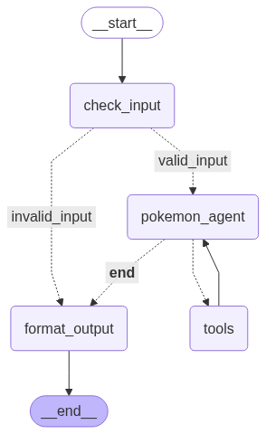

# LangGraph Pokemon Basic Agent

A learning project to practice the basics of LangGraph by building a Pokemon type effectiveness agent. This agent can extract Pokemon names from user input, retrieve their types, and calculate type effectiveness charts.

## Features

- **Input Validation**: Automatically extracts and validates Pokemon names from natural language input
- **Pokemon Type Retrieval**: Fetches Pokemon types using the PokeAPI
- **Type Effectiveness Analysis**: Calculates complete type effectiveness charts including:
  - Super effective types (4x and 2x damage)
  - Resistant types (0.5x and 0.25x damage)  
  - Immune types (0x damage)
- **Interactive Chat Interface**: Simple command-line interface for querying Pokemon information
- **Comprehensive Testing**: Unit tests for all core components
- **Graph Visualization**: Automatically generates a visual representation of the agent's workflow

## Prerequisites

- Python 3.10 or higher
- Poetry (for dependency management)
- OpenAI API key (set as `OPENAI_API_KEY` environment variable)

## Setup

1. **Clone the repository**:
   ```bash
   git clone <repository-url>
   cd langgraph-pokemon-basic-agent
   ```

2. **Install dependencies**:
   ```bash
   poetry install
   ```

3. **Set up your OpenAI API key**:
   ```bash
   export OPENAI_API_KEY="your-api-key-here"
   ```

## Usage

### Interactive Mode

Run the agent in interactive mode:

```bash
poetry run python run.py
```

Or use the package script:

```bash
poetry run pokemon-agent
```

### Example Interactions

```
You: Tell me about Pikachu's type effectiveness
Agent: The pokemon pikachu has the following types: ['electric'].
This is the type chart with the types that are super effective, effective, resistant, super resistant and immune to the pokemon:
Effective: flying, water
Resistant: electric, flying, steel

You: What about Charizard?
Agent: The pokemon charizard has the following types: ['fire', 'flying'].
This is the type chart with the types that are super effective, effective, resistant, super resistant and immune to the pokemon:
Super Effective: electric, rock, water
Effective: ice
Resistant: bug, fire, grass, steel
Super Resistant: grass
Immune: ground

You: *
# Exits the program
```

## Project Structure

```
langgraph-pokemon-basic-agent/
├── src/
│   ├── main.py                    # Main StateGraph definition and compilation
│   ├── pokemon_agent_nodes.py     # Agent workflow nodes (input validation, processing, output)
│   ├── pokemon_agent_tools.py     # LangChain tools for Pokemon API interaction
│   ├── pokemon_agent_prompts.py   # System prompts for the LLM
│   ├── pokemon_state.py           # State management for the agent
│   ├── pokemon_type_chart.py      # Data class for type effectiveness charts
│   ├── run_agent.py              # Alternative runner script
│   └── logging_config.py         # Centralized logging configuration
├── tests/
│   ├── test_pokemon_agent_nodes.py  # Tests for agent nodes
│   └── test_pokemon_agent_tools.py  # Tests for Pokemon tools
├── run.py                        # Main entry point script
├── pyproject.toml               # Project configuration and dependencies
└── pokemon_agent_graph.png     # Auto-generated graph visualization
```

## Graph



The agent is built using LangGraph and follows a state-based workflow:

1. **Input Validation** (`check_input`): Extracts and validates Pokemon names from user input
2. **Pokemon Processing** (`pokemon_agent`): Retrieves Pokemon types and calculates type effectiveness
3. **Tool Execution** (`tools`): Handles API calls to Pokemon data sources
4. **Output Formatting** (`format_output`): Formats the response for user consumption

The workflow automatically handles invalid inputs and provides appropriate feedback.

## Dependencies

- **langgraph**: State-based agent framework
- **langchain-openai**: OpenAI integration for LLM capabilities
- **pokebase**: Python wrapper for the PokeAPI
- **attrs**: Modern Python class definitions

## Testing

Run the test suite:

```bash
# Run all tests
poetry run pytest /tests
```

## Development

This project uses:
- **Poetry** for dependency management
- **Ruff** for code formatting and linting
- **pytest** for testing
- **Structured logging** for debugging and monitoring

## License

MIT License - see LICENSE file for details.

